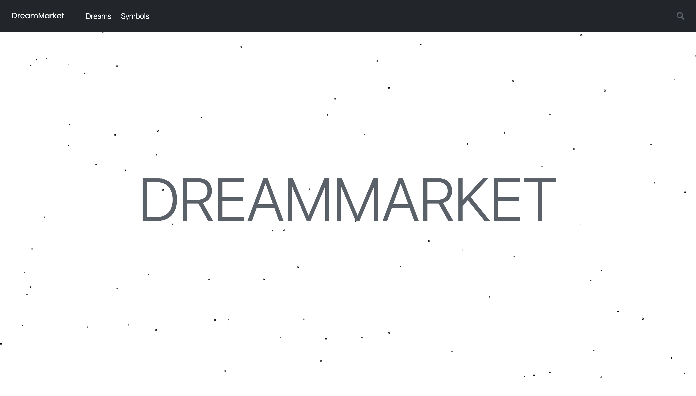

# dreamMarket


# Portfolio V2

[](https://standardjs.com)
This is a full-stack application made for my interest in Psyhcology. It allows you to add dreams and stories without a logging in or registering. 

Available routes:
- `/home`
- `/dreams`


## Table of contents
* [Technologies](#technologies)
* [Setup](#setup)
* [Used packages and tools](#used-packages-and-tools)


## Technologies

- ReactJS
- React Hooks
- React Particles
- Shards UI
- JavaScript ES6


## Setup

```bash
  git clone https://github.com/octaviandd/DREAMMARKET.git
  npm install
  npm start
```

## Used packages and tools

- Colors.co [Colors Picker](https://coolors.co/)
- Gradients [uIGradients](https://uigradients.com/)


